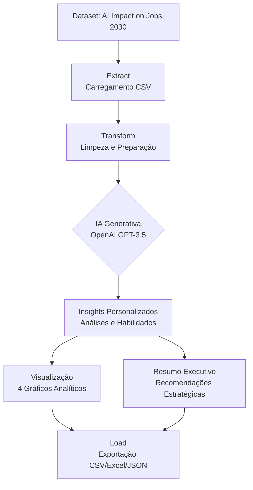

# 📊 Projeto: ETL com IA Generativa - Impacto da IA nos Empregos 2030

**ETL com IA Generativa** - Pipeline completo que analisa o impacto da IA no mercado de trabalho até 2030. 
Extrai dados de automação, transforma com OpenAI GPT, gera insights personalizados e visualiza tendências. 
Exporta resultados em CSV/Excel.

## 🎯 Visão Geral

Este projeto implementa um pipeline ETL (Extração, Transformação e Carregamento) completo que utiliza IA Generativa (OpenAI GPT) para analisar o impacto da Inteligência Artificial em diferentes profissões até 2030. O sistema processa dados de automação de empregos, gera insights personalizados com IA e produz visualizações interativas.

**Objetivos Principais:**
- Extrair dados de automação de empregos do dataset "AI Impact on Jobs 2030"
- Transformar dados brutos em insights acionáveis usando IA Generativa
- Identificar prioridades de requalificação profissional
- Visualizar tendências do mercado de trabalho
- Gerar recomendações estratégicas baseadas em dados

## 🏗️ Arquitetura do Projeto



## ✨ Funcionalidades

### 🔍 **Extração (Extract)**
- Upload de arquivos CSV via Google Colab
- Leitura e validação de dados do dataset
- Identificação automática de colunas relevantes
- Tratamento de valores nulos e inconsistências

### 🔄 **Transformação (Transform)**
- **Limpeza de Dados:** Normalização de colunas, tratamento de missing values
- **IA Generativa:** Integração com OpenAI GPT-3.5 para gerar insights
- **Análises Personalizadas:** Para cada profissão, gera:
  - Análise qualitativa do impacto da IA
  - 3 habilidades futuras recomendadas
  - Prioridade de requalificação (alta/média/baixa)
  - Tendência para 2030 (automatizado/transformado/expandido)

### 📈 **Visualização (Visualization)**
1. **Distribuição de Prioridades** - Gráfico de barras com porcentagens
2. **Tendências 2030** - Gráfico de pizza com destaque
3. **Word Cloud** - Palavras-chave mais frequentes nos insights
4. **Top 10 Habilidades** - Gráfico horizontal com gradiente de cores

### 💾 **Carregamento (Load)**
- Exportação para múltiplos formatos (CSV, Excel, JSON)
- Nomeação automática com timestamp
- Links diretos para download no Colab

### 📊 **Análise Avançada**
- Resumo executivo gerado por IA
- Estatísticas descritivas automáticas
- Recomendações estratégicas para RH e gestores

## 🛠️ Tecnologias Utilizadas

### **Linguagens e Frameworks**
-  - Linguagem principal
-  - Manipulação de dados
-  - Gráficos estáticos
-  - Estatísticas visuais
-  - Nuvem de palavras

### **APIs e Serviços**
-  - IA Generativa
-  - Ambiente de execução
-  - Dataset fonte

### **Ferramentas de Desenvolvimento**
-  - Notebook interativo
-  - Controle de versão
-  - Hospedagem de código

## ⚙️ Instalação e Configuração

### **Pré-requisitos**
- Python 3.8 ou superior
- Conta no Google Colab (recomendado) ou Jupyter Notebook
- Chave de API da OpenAI ([obtenha aqui](https://platform.openai.com/api-keys))

### **Configuração Rápida no Google Colab**

1. **Clone o repositório ou faça upload do notebook:**
```bash
# No Colab, use o upload de arquivo
# Ou clone diretamente:
!git clone https://github.com/DanielHespanhol/ETL-com-IA-Generativa.git
%cd ETL-com-IA-Generativa
```

2. **Instale as dependências:**
```python
# Executar a primeira célula do notebook
!pip install pandas openai python-dotenv kaggle -q
!pip install matplotlib seaborn wordcloud tqdm -q
```

3. **Configure sua API Key da OpenAI:**
```python
# Quando solicitado, insira sua chave da OpenAI
# O sistema fará um teste de conexão automático
```

4. **Faça upload do dataset:**
   - Opção A: Upload manual do arquivo [AI_Impact_on_Jobs_2030.csv](https://www.kaggle.com/datasets/khushikyad001/ai-impact-on-jobs-2030/data?select=AI_Impact_on_Jobs_2030.csv)
   - Opção B: Use a API do Kaggle (configurar kaggle.json)

## 🚀 Uso do Sistema

### **Fluxo de Trabalho Completo**

1. **Execução do Pipeline ETL:**
```python
# O notebook está organizado em 6 seções principais:
# 1. EXTRACT   → Extração dos dados
# 2. PREPARAÇÃO → Configuração da IA
# 3. TRANSFORM → Transformação com IA
# 4. VISUALIZAÇÃO → Análise gráfica
# 5. LOAD → Exportação dos resultados
# 6. RESUMO → Relatório executivo
```

2. **Parâmetros Personalizáveis:**
```python
# No notebook, você pode ajustar:
sample_size = 10  # Número de amostras para análise com IA
provider = "openai"  # OpenAI ou Gemini
output_format = "csv"  # CSV, Excel ou JSON
```

3. **Execução por Seção:**
   - Execute as células em ordem sequencial
   - Cada seção é independente mas depende das anteriores
   - A seção de visualização gera 4 gráficos automaticamente

### **Exemplo de Uso no Colab**
```python
# 1. Execute todas as células até "TRANSFORM"
# 2. Ajuste o sample_size conforme necessário
# 3. Aguarde a geração dos insights pela IA (≈1-2s por registro)
# 4. Visualize os gráficos gerados
# 5. Exporte os resultados
# 6. Leia o resumo executivo gerado
```

## 📊 Resultados e Visualizações

### **Saídas Geradas**

1. **DataFrame Transformado** com colunas adicionais:
   - `ai_insight`: Análise qualitativa da IA
   - `habilidades_futuras`: Habilidades recomendadas
   - `prioridade_requalificacao`: Prioridade (alta/média/baixa)
   - `tendencia_2030`: Tendência (automatizado/transformado/expandido)

2. **Visualizações Gráficas:**
   - Gráfico de distribuição de prioridades
   - Gráfico de pizza de tendências
   - Word Cloud de palavras-chave
   - Top 10 habilidades do futuro

3. **Arquivos Exportados:**
   - CSV com todos os dados transformados
   - Excel formatado (opcional)
   - JSON estruturado (opcional)

4. **Relatório Executivo:**
   - Análise estratégica gerada por IA
   - Recomendações para tomadores de decisão
   - Insights sobre o mercado de trabalho 2030

### **Exemplo de Insights Gerados**
| Cargo | Score IA | Prioridade | Habilidades Futuras | Tendência |
|-------|----------|------------|---------------------|-----------|
| Data Scientist | 0.75 | Alta | ML Avançado, Ética em IA, Storytelling | Transformado |
| Professor | 0.35 | Baixa | Tutoria Personalizada, EdTech, Mentoria | Expandido |

## 🤝 Contribuição

Contribuições são bem-vindas! Siga estes passos:

1. **Faça um Fork do projeto**
2. **Crie uma Branch para sua feature**
```bash
git checkout -b feature/nova-feature
```
3. **Commit suas mudanças**
```bash
git commit -m "Adiciona nova funcionalidade"
```
4. **Push para a Branch**
```bash
git push origin feature/nova-feature
```
5. **Abra um Pull Request**

### **Áreas para Melhoria**
- [ ] Adicionar mais provedores de IA (Claude, Gemini, Llama)
- [ ] Implementar cache para reduzir custos de API
- [ ] Criar dashboard interativo com Streamlit
- [ ] Adicionar análise temporal comparativa
- [ ] Implementar testes automatizados

## 📄 Licença

Este projeto está licenciado sob a Licença MIT - veja o arquivo [LICENSE](LICENSE) para detalhes.

## 📞 Contato

**Desenvolvedor:** [Daniel Hespanhol]  
**Email:** [ds.danielhespanhol@gmail.com]  
**GitHub:** [@seu-usuario](https://github.com/DanielHespanhol)  
**LinkedIn:** [Daniel Hespanhol]([https://linkedin.com/in/seu-perfil]https://www.linkedin.com/in/danielhespanhol-dados/)  
**Projeto Original:** Santander Dev Week 2025 - ETL com IA Generativa  
**Dataset:** [AI Impact on Jobs 2030](https://www.kaggle.com/datasets/khushikyad001/ai-impact-on-jobs-2030)  

---

## ⭐ Destaques do Projeto

✅ **Pipeline ETL Completo** - End-to-end data processing  
✅ **IA Generativa Integrada** - Insights personalizados com OpenAI  
✅ **Visualizações Profissionais** - 4 gráficos analíticos  
✅ **Fácil Configuração** - Pronto para usar no Google Colab  
✅ **Exportação Multi-formato** - CSV, Excel, JSON  
✅ **Documentação Completa** - Guias detalhados de uso  

---

## 🔮 Roadmap Futuro

- [ ] Versão web com Streamlit
- [ ] Análise preditiva com Machine Learning
- [ ] Integração com APIs de mercado de trabalho
- [ ] Dashboard em tempo real
- [ ] Módulo de recomendações personalizadas por perfil

---

<div align="center">
  <p>Desenvolvido com ❤️ para a comunidade de Data Science</p>
  <p>Se este projeto foi útil, considere dar uma ⭐ no repositório!</p>
</div>
```

## 📝 **Arquivo requirements.txt** (considere adicionar ao projeto)

```txt
# requirements.txt
pandas>=2.0.0
openai>=1.0.0
python-dotenv>=1.0.0
matplotlib>=3.7.0
seaborn>=0.12.0
wordcloud>=1.9.0
tqdm>=4.65.0
jupyter>=1.0.0
notebook>=7.0.0
```

## 📁 **Arquivo .env.example** (considere adicionar ao projeto)

```env
# .env.example
OPENAI_API_KEY=sua_chave_aqui
# GEMINI_API_KEY=sua_chave_aqui  # Opcional
# KAGGLE_USERNAME=seu_usuario     # Opcional
# KAGGLE_KEY=sua_chave_kaggle     # Opcional
```

