# 📊 Projeto: ETL com IA Generativa - Impacto da IA nos Empregos 2030

**ETL com IA Generativa** - Pipeline completo que analisa o impacto da IA no mercado de trabalho até 2030. 
Extrai dados de automação, transforma com OpenAI GPT, gera insights personalizados e visualiza tendências. 
Exporta resultados em CSV/Excel.

[](https://www.python.org/)
[](https://openai.com/)
[](LICENSE)
[](https://en.wikipedia.org/wiki/Extract,_transform,_load)

> Pipeline ETL com IA Generativa para análise do impacto da Inteligência Artificial no mercado de trabalho até 2030.

## 🎯 Visão Geral

Este projeto implementa um pipeline ETL (Extração, Transformação e Carregamento) completo que utiliza IA Generativa (OpenAI GPT) para analisar o impacto da Inteligência Artificial em diferentes profissões até 2030. O sistema processa dados de automação de empregos, gera insights personalizados com IA e produz visualizações interativas.

**Objetivos Principais:**
- Extrair dados de automação de empregos do dataset "AI Impact on Jobs 2030"
- Transformar dados brutos em insights acionáveis usando IA Generativa
- Identificar prioridades de requalificação profissional
- Visualizar tendências do mercado de trabalho
- Gerar recomendações estratégicas baseadas em dados

## 🏗️ Arquitetura do Projeto

```mermaid
graph TD
    A[Dataset: AI Impact on Jobs 2030] --> B[Extract<br/>Carregamento CSV]
    B --> C[Transform<br/>Limpeza e Preparação]
    C --> D{IA Generativa<br/>OpenAI GPT-3.5}
    D --> E[Insights Personalizados<br/>Análises e Habilidades]
    E --> F[Visualização<br/>4 Gráficos Analíticos]
    E --> G[Resumo Executivo<br/>Recomendações Estratégicas]
    F --> H[Load<br/>Exportação CSV/Excel/JSON]
    G --> H
```



Ou se preferir uma versão mais compacta:

```mermaid
graph TD
    A[Dataset Kaggle] --> B[📥 Extract]
    B --> C[🔄 Transform]
    C --> D[🤖 IA Generativa]
    D --> E[💡 Insights]
    E --> F[📊 Visualização]
    E --> G[📋 Resumo]
    F --> H[📤 Exportação]
    G --> H
```



## ✨ Funcionalidades

### 🔍 **Extração (Extract)**
- Upload de arquivos CSV via Google Colab
- Leitura e validação de dados do dataset
- Identificação automática de colunas relevantes
- Tratamento de valores nulos e inconsistências

### 🔄 **Transformação (Transform)**
- **Limpeza de Dados:** Normalização de colunas, tratamento de missing values
- **IA Generativa:** Integração com OpenAI GPT-3.5 para gerar insights
- **Análises Personalizadas:** Para cada profissão, gera:
  - Análise qualitativa do impacto da IA
  - 3 habilidades futuras recomendadas
  - Prioridade de requalificação (alta/média/baixa)
  - Tendência para 2030 (automatizado/transformado/expandido)

### 📈 **Visualização (Visualization)**
1. **Distribuição de Prioridades** - Gráfico de barras com porcentagens
2. **Tendências 2030** - Gráfico de pizza com destaque
3. **Word Cloud** - Palavras-chave mais frequentes nos insights
4. **Top 10 Habilidades** - Gráfico horizontal com gradiente de cores

### 💾 **Carregamento (Load)**
- Exportação para múltiplos formatos (CSV, Excel, JSON)
- Nomeação automática com timestamp
- Links diretos para download no Colab

### 📊 **Análise Avançada**
- Resumo executivo gerado por IA
- Estatísticas descritivas automáticas
- Recomendações estratégicas para RH e gestores

## 🛠️ Tecnologias Utilizadas

### **Linguagens e Frameworks**
-  - Linguagem principal
-  - Manipulação de dados
-  - Gráficos estáticos
-  - Estatísticas visuais
-  - Nuvem de palavras

### **APIs e Serviços**
-  - IA Generativa
-  - Ambiente de execução
-  - Dataset fonte

### **Ferramentas de Desenvolvimento**
-  - Notebook interativo
-  - Controle de versão
-  - Hospedagem de código

## ⚙️ Instalação e Configuração

### **Pré-requisitos**
- Python 3.8 ou superior
- Conta no Google Colab (recomendado) ou Jupyter Notebook
- Chave de API da OpenAI ([obtenha aqui](https://platform.openai.com/api-keys))

### **Configuração Rápida no Google Colab**

1. **Clone o repositório ou faça upload do notebook:**
```bash
# No Colab, use o upload de arquivo
# Ou clone diretamente:
!git clone https://github.com/DanielHespanhol/ETL-com-IA-Generativa.git
%cd ETL-com-IA-Generativa
```

2. **Instale as dependências:**
```python
# Executar a primeira célula do notebook
!pip install pandas openai python-dotenv kaggle -q
!pip install matplotlib seaborn wordcloud tqdm -q
```

3. **Configure sua API Key da OpenAI:**
```python
# Quando solicitado, insira sua chave da OpenAI
# O sistema fará um teste de conexão automático
```

4. **Faça upload do dataset:**
   - Opção A: Upload manual do arquivo `[AI_Impact_on_Jobs_2030.csv]([link](https://www.kaggle.com/datasets/khushikyad001/ai-impact-on-jobs-2030/data?select=AI_Impact_on_Jobs_2030.csv)`
   - Opção B: Use a API do Kaggle (configurar kaggle.json)

### **Configuração Local**
```bash
# Clone o repositório
git clone https://github.com/seu-usuario/santander-etl-ia.git
cd santander-etl-ia

# Crie um ambiente virtual
python -m venv venv
source venv/bin/activate  # Linux/Mac
# ou
venv\Scripts\activate     # Windows

# Instale as dependências
pip install -r requirements.txt

# Configure variáveis de ambiente
echo "OPENAI_API_KEY=sua_chave_aqui" > .env

# Execute o notebook
jupyter notebook Santander_2025_ETL_V2.ipynb
```

## 🚀 Uso do Sistema

### **Fluxo de Trabalho Completo**

1. **Execução do Pipeline ETL:**
```python
# O notebook está organizado em 6 seções principais:
# 1. EXTRACT   → Extração dos dados
# 2. PREPARAÇÃO → Configuração da IA
# 3. TRANSFORM → Transformação com IA
# 4. VISUALIZAÇÃO → Análise gráfica
# 5. LOAD → Exportação dos resultados
# 6. RESUMO → Relatório executivo
```

2. **Parâmetros Personalizáveis:**
```python
# No notebook, você pode ajustar:
sample_size = 10  # Número de amostras para análise com IA
provider = "openai"  # OpenAI ou Gemini
output_format = "csv"  # CSV, Excel ou JSON
```

3. **Execução por Seção:**
   - Execute as células em ordem sequencial
   - Cada seção é independente mas depende das anteriores
   - A seção de visualização gera 4 gráficos automaticamente

### **Exemplo de Uso no Colab**
```python
# 1. Execute todas as células até "TRANSFORM"
# 2. Ajuste o sample_size conforme necessário
# 3. Aguarde a geração dos insights pela IA (≈1-2s por registro)
# 4. Visualize os gráficos gerados
# 5. Exporte os resultados
# 6. Leia o resumo executivo gerado
```

## 📊 Resultados e Visualizações

### **Saídas Geradas**

1. **DataFrame Transformado** com colunas adicionais:
   - `ai_insight`: Análise qualitativa da IA
   - `habilidades_futuras`: Habilidades recomendadas
   - `prioridade_requalificacao`: Prioridade (alta/média/baixa)
   - `tendencia_2030`: Tendência (automatizado/transformado/expandido)

2. **Visualizações Gráficas:**
   - Gráfico de distribuição de prioridades
   - Gráfico de pizza de tendências
   - Word Cloud de palavras-chave
   - Top 10 habilidades do futuro

3. **Arquivos Exportados:**
   - CSV com todos os dados transformados
   - Excel formatado (opcional)
   - JSON estruturado (opcional)

4. **Relatório Executivo:**
   - Análise estratégica gerada por IA
   - Recomendações para tomadores de decisão
   - Insights sobre o mercado de trabalho 2030

### **Exemplo de Insights Gerados**
| Cargo | Score IA | Prioridade | Habilidades Futuras | Tendência |
|-------|----------|------------|---------------------|-----------|
| Data Scientist | 0.75 | Alta | ML Avançado, Ética em IA, Storytelling | Transformado |
| Professor | 0.35 | Baixa | Tutoria Personalizada, EdTech, Mentoria | Expandido |

## 📁 Estrutura de Arquivos

```
santander-etl-ia/
├── Santander_2025_ETL_V2.ipynb          # Notebook principal
├── README.md                            # Este arquivo
├── requirements.txt                     # Dependências do projeto
├── .env.example                         # Exemplo de variáveis de ambiente
├── data/                                # Dados (gerado automaticamente)
│   ├── AI_Impact_on_Jobs_2030.csv      # Dataset original
│   └── ai_jobs_analysis_YYYYMMDD_HHMMSS.csv  # Resultados exportados
└── images/                              # Imagens para documentação
    ├── architecture.png                 # Diagrama de arquitetura
    └── dashboard_example.png            # Exemplo de visualização
```

## 🤝 Contribuição

Contribuições são bem-vindas! Siga estes passos:

1. **Faça um Fork do projeto**
2. **Crie uma Branch para sua feature**
```bash
git checkout -b feature/nova-feature
```
3. **Commit suas mudanças**
```bash
git commit -m "Adiciona nova funcionalidade"
```
4. **Push para a Branch**
```bash
git push origin feature/nova-feature
```
5. **Abra um Pull Request**

### **Áreas para Melhoria**
- [ ] Adicionar mais provedores de IA (Claude, Gemini, Llama)
- [ ] Implementar cache para reduzir custos de API
- [ ] Criar dashboard interativo com Streamlit
- [ ] Adicionar análise temporal comparativa
- [ ] Implementar testes automatizados

## 📄 Licença

Este projeto está licenciado sob a Licença MIT - veja o arquivo [LICENSE](LICENSE) para detalhes.

## 📞 Contato

**Desenvolvedor:** [Seu Nome]  
**Email:** [seu-email@exemplo.com]  
**GitHub:** [@seu-usuario](https://github.com/seu-usuario)  
**LinkedIn:** [Seu Perfil](https://linkedin.com/in/seu-perfil)  

**Projeto Original:** Santander Dev Week 2023 - ETL com IA Generativa  
**Dataset:** [AI Impact on Jobs 2030](https://www.kaggle.com/datasets/khushikyad001/ai-impact-on-jobs-2030)  

---

## ⭐ Destaques do Projeto

✅ **Pipeline ETL Completo** - End-to-end data processing  
✅ **IA Generativa Integrada** - Insights personalizados com OpenAI  
✅ **Visualizações Profissionais** - 4 gráficos analíticos  
✅ **Fácil Configuração** - Pronto para usar no Google Colab  
✅ **Exportação Multi-formato** - CSV, Excel, JSON  
✅ **Documentação Completa** - Guias detalhados de uso  

---

## 🔮 Roadmap Futuro

- [ ] Versão web com Streamlit
- [ ] Análise preditiva com Machine Learning
- [ ] Integração com APIs de mercado de trabalho
- [ ] Dashboard em tempo real
- [ ] Módulo de recomendações personalizadas por perfil

---

<div align="center">
  <p>Desenvolvido com ❤️ para a comunidade de Data Science</p>
  <p>Se este projeto foi útil, considere dar uma ⭐ no repositório!</p>
</div>
```

## 📝 **Arquivo requirements.txt** (adicione ao projeto)

```txt
# requirements.txt
pandas>=2.0.0
openai>=1.0.0
python-dotenv>=1.0.0
matplotlib>=3.7.0
seaborn>=0.12.0
wordcloud>=1.9.0
tqdm>=4.65.0
jupyter>=1.0.0
notebook>=7.0.0
```

## 📁 **Arquivo .env.example** (adicione ao projeto)

```env
# .env.example
OPENAI_API_KEY=sua_chave_aqui
# GEMINI_API_KEY=sua_chave_aqui  # Opcional
# KAGGLE_USERNAME=seu_usuario     # Opcional
# KAGGLE_KEY=sua_chave_kaggle     # Opcional
```

## 🚀 **Como usar no GitHub:**

1. **Crie os arquivos no seu projeto:**
   - `README.md` (copie o conteúdo acima)
   - `requirements.txt` (copie o conteúdo acima)
   - `.env.example` (copie o conteúdo acima)
   - `LICENSE` (adicione uma licença MIT)

2. **Configure seu repositório:**
```bash
# Inicialize o git
git init

# Adicione os arquivos
git add README.md requirements.txt .env.example LICENSE Santander_2025_ETL_V2.ipynb

# Commit
git commit -m "Initial commit: ETL com IA Generativa"

# Conecte ao GitHub
git remote add origin https://github.com/seu-usuario/santander-etl-ia.git

# Push
git branch -M main
git push -u origin main
```

3. **Adicione badges personalizados** (opcional):
   - Vá para https://shields.io/
   - Crie badges para suas tecnologias
   - Atualize o README.md

Este README está pronto para impressionar! Ele inclui:
- ✅ Badges profissionais
- ✅ Diagrama de arquitetura (em texto)
- ✅ Instruções detalhadas de instalação
- ✅ Exemplos de uso
- ✅ Estrutura de arquivos
- ✅ Seção de contribuição
- ✅ Roadmap futuro
- ✅ Informações de contato

Precisa de mais alguma adaptação?
